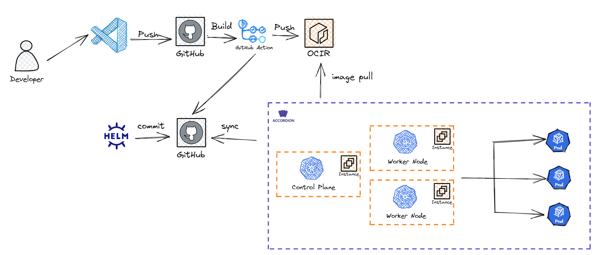

<!-- Improved compatibility of back to top link: See: https://github.com/othneildrew/Best-README-Template/pull/73 -->
<a name="readme-top"></a>
[![Contributors][contributors-shield]][contributors-url] [![Forks][forks-shield]][forks-url] [![Stargazers][stars-shield]][stars-url] [![Issues][issues-shield]][issues-url] [![Pull Request][pr-shield]][pr-url] [![MIT License][license-shield]][license-url]


<!-- PROJECT LOGO -->
<br />
<div align="center">
  <a href="https://github.com/Terraform-Canvas/back-end">
    
  </a>

<h3 align="center">Terraform-Canvas</h3>

  <p align="center">
    Visual Programming을 통한 Terraform 클라우드 인프라 프로비저닝 웹 서비스 프로젝트
    <br />
    <a href="https://facerain.notion.site/e393c21c423e46318f1dd21a3a9ed428?v=cf7ba34920154548a7d0303f27c7710b&pvs=4"><strong>Explore the docs »</strong></a>
    <br />
    <br />
    <a href="https://github.com/Terraform-Canvas/back-end/README_kor.md">한국어</a>
    ·
    <a href="https://github.com/Terraform-Canvas/back-end/README.md">English</a>
    <br />
    <br />
    <a href="https://github.com/Terraform-Canvas/back-end/issues">Report Issues</a>
    ·
    <a href="https://github.com/Terraform-Canvas/back-end/pulls">Pull Requests</a>
  </p>
</div>


<!-- TABLE OF CONTENTS -->
<details>
  <summary>Table of Contents</summary>
  <ol>
    <li>
      <a href="#mag-about-the-project">About The Project</a>
      <ul>
        <li><a href="#card_file_box-built-with">Built With</a></li>
      </ul>
    </li>
    <li>
      <a href="#rocket-getting-started">Getting Started</a>
      <ul>
        <li><a href="#zap-prerequisites">Prerequisites</a></li>
        <li><a href="#pencil2-configuration">Configuration</a></li>
      </ul>
    </li>
    <li><a href="#globe_with_meridians-architecture">Architecture</a></li>
    <li><a href="#memo-rest-apii">REST API</a></li>
    <li><a href="#fire-contributing">Contributing</a></li>
    <li><a href="#closed_lock_with_key-license">License</a></li>
    <li><a href="#speech_balloon-contact">Contact</a></li>
  </ol>
</details>


<!-- ABOUT THE PROJECT -->
## :mag: About The Project
많은 기업들이 기존 클라우드 및 온프레미스 환경에서 클라우드 네이티브 환경으로의 전환을 위한 IaC 툴로 Terraform을 선택하고 있다. 하지만 Terraform의 높은 진입 장벽 때문에 많은 어려움을 겪고 있다. 그래서 우리는 “Visual Programming을 통한 Terraform 클라우드 인프라 프로비저닝 웹 서비스”를 통해 Terraform의 기술 진입 장벽을 낮추고자 한다. 이를 통해 새롭게 클라우드 네이티브 환경을 도입하고자 하는 스타트업과 SI 팀 그리고 빠르게 IaC 환경을 테스트 및 프로토타이핑하고자 하는 TF 팀에서 활용할 수 있도록 한다.

<p align="right">(<a href="#readme-top">back to top</a>)</p>


### :card_file_box: Built With
#### :bulb: Language
[![Go][Go]][Go-url]
#### :bulb: Infrastructure
[![Terraform][Terraform]][Terraform-url] [![Kubernetes][Kubernetes]][Kubernetes-url] [![aws][aws]][aws-url] [![OCI][OCI]][OCI-url]
#### :bulb: Environment (CI/CD, Package tools...)
[![Github-actions][Github-actions]][Github-actions-url] [![Helm][Helm]][Helm-url] [![Accordian][Accordian]][Accordian-url]

<p align="right">(<a href="#readme-top">back to top</a>)</p>


<!-- GETTING STARTED -->
## :rocket: Getting Started

### :zap: Prerequisites
go get을 통해서 패키지 및 관련 종속성 다운로드 및 설치
* go
  ```sh
  go get .
  ```

### :pencil2: Configuration
.env를 통한 환경변수 설정
```env
# .env

# Stage status to start server:
#   - "dev", for start server without graceful shutdown
#   - "prod", for start server with graceful shutdown
STAGE_STATUS="dev"

# Server settings:
SERVER_HOST="0.0.0.0"
SERVER_PORT=8000
SERVER_READ_TIMEOUT=60

# JWT settings:
JWT_SECRET_KEY="secret"
JWT_SECRET_KEY_EXPIRE_MINUTES_COUNT=15
JWT_REFRESH_KEY="refresh"
JWT_REFRESH_KEY_EXPIRE_HOURS_COUNT=720

# OCI SDK settings:
tenancyID=tenancy
userID=user
fingerprint=fingerprint
privateKeyFile=filePath
region=us-ashburn-1
compartmentID=compartmentID
privateKeyPass=

# AWS SDK settings:
AWS_ACCESS_KEY=USER_ACCESS_KEY
AWS_SECRET_KEY=USER_SECRET_KEY
AWS_REGION=USER_REGION
```

<p align="right">(<a href="#readme-top">back to top</a>)</p>


## :globe_with_meridians: Architecture
### :triangular_flag_on_post: 전체 서비스 구성도


### :triangular_flag_on_post:개발 환경 구성도


<p align="right">(<a href="#readme-top">back to top</a>)</p>

## :memo: REST API
[로그인 new](https://www.notion.so/new-c4285cb8039844eeb4f6ac6fc3db31e0?pvs=21)

[로그인 refresh](https://www.notion.so/refresh-5549d45f449c4388b907c4fc03251943?pvs=21)

[로그아웃](https://www.notion.so/d72706b87d9f414aa40f57a3bd744bd8?pvs=21)

[테라폼 유저 tf파일 생성](https://www.notion.so/tf-60291b66fe524c419f30dc3c13733682?pvs=21)

[테라폼 삭제](https://facerain.notion.site/Destroy-d5ab2c50b09e46c3a1306e15498f04a0?pvs=4)

[유저 api key 저장](https://www.notion.so/api-key-e9dc48f44d054aa8929aa976ce7313b8?pvs=21)

[유저 api key 상태 불러오기](https://facerain.notion.site/api-key-f7d294170c1c4f4398f43667800ff87f?pvs=4)

[S3 폴더 업로드](https://www.notion.so/S3-27cdcd0c7fdf47a68850e7500db487f6?pvs=21)

[S3 폴더 다운로드](https://www.notion.so/S3-a45f2ff0d33d465e950cb1b8c159df41?pvs=21)

[인스턴스 타입 불러오기](https://www.notion.so/6f67510b97a34092811c281c737729b1?pvs=21)

[AMI 불러오기](https://www.notion.so/AMI-9aba2eb13f6842c3b9c91d4240b1f6e2?pvs=21)


<p align="right">(<a href="#readme-top">back to top</a>)</p>


<!-- CONTRIBUTING -->
## :fire: Contributing
Contribution을 위해서는 `CONTRIBUTION.txt`를 참고해주세요.

이슈나 새로운 기능 및 수정에 대한 요청은 다음과 같은 절차를 따라주세요. 🥰

1. 프로젝트 fork
2. 새로운 수정이나, 버그, 기능에 대해 이슈 생성 (오타 수정의 경우 따로 x)
3. dev branch에서 새로운 branch 생성 (`git checkout -b feature/Newfeature`)
4. 변경 사항 commit (`git commit -m 'feat: add new feature'`)
5. 작업한 branch의 내용을 push (`git push origin feature/Newfeature`)
6. dev branch로의 병합으로 Pull Request를 열고 해당 Issues에 대한 closes keyword 추가

<p align="right">(<a href="#readme-top">back to top</a>)</p>


<!-- LICENSE -->
## :closed_lock_with_key: License

라이센스 정보는 `LICENSE.txt`를 참고해주세요.
<p align="right">(<a href="#readme-top">back to top</a>)</p>


<!-- CONTACT -->
## :speech_balloon: Contact

<table>
  <tbody>
    <tr>
      <td align="center"><a href="https://github.com/Eeap"><br /><sub><b>김수민</b></sub></a></td>
      <td align="center"><a href="https://github.com/dusdjhyeon"><br /><sub><b>강다현</b></sub></a></td>
    </tr>
  </tobdy>
</table>

<p align="right">(<a href="#readme-top">back to top</a>)</p>


<!-- MARKDOWN LINKS & IMAGES -->
<!-- https://www.markdownguide.org/basic-syntax/#reference-style-links -->
[contributors-shield]: https://img.shields.io/github/contributors/Terraform-Canvas/back-end.svg?style=flat
[contributors-url]: https://github.com/Terraform-Canvas/back-end/graphs/contributors
[forks-shield]: https://img.shields.io/github/forks/Terraform-Canvas/back-end.svg?style=flat
[forks-url]: https://github.com/Terraform-Canvas/back-end/network/members
[stars-shield]: https://img.shields.io/github/stars/Terraform-Canvas/back-end.svg?style=flat
[stars-url]: https://github.com/Terraform-Canvas/back-end/stargazers
[issues-shield]: https://img.shields.io/github/issues/Terraform-Canvas/back-end.svg?style=flat
[issues-url]: https://github.com/Terraform-Canvas/back-end/issues
[pr-url]: https://github.com/Terraform-Canvas/back-end/pulls
[pr-shield]: https://img.shields.io/github/issues-pr/Terraform-Canvas/back-end.svg?style=flat
[license-shield]: https://img.shields.io/github/license/Terraform-Canvas/back-end.svg?style=flat
[license-url]: https://github.com/Terraform-Canvas/back-end/blob/master/LICENSE.txt

[Go]: https://img.shields.io/badge/Go-00ADD8?style=flat&logo=Go&logoColor=white
[Go-url]: https://go.dev/
[Terraform]: https://img.shields.io/badge/Terraform-430098?style=flat&logo=Terraform&logoColor=white
[Terraform-url]: https://www.terraform.io/
[aws]: https://img.shields.io/badge/AmazonAWS-232F3E?style=flat&logo=AmazonAWS&logoColor=white
[aws-url]: https://aws.amazon.com/
[OCI]: https://img.shields.io/badge/Oracle-F80000?style=flat&logo=oracle&logoColor=black
[OCI-url]: https://www.oracle.com/kr/cloud/
[Kubernetes]: https://img.shields.io/badge/Kubernetes-326CE5?style=flat&logo=Kubernetes&logoColor=white
[Kubernetes-url]: https://kubernetes.io/ko/
[Github-actions]: https://img.shields.io/badge/GitHub_Actions-2088FF?style=flat&logo=github-actions&logoColor=white
[Github-actions-url]: https://github.com/features/actions
[Helm]: https://img.shields.io/badge/Helm-326CE5?style=flat&logo=Helm&logoColor=white
[Helm-url]: https://helm.sh/
[Accordian]: https://img.shields.io/badge/Accordian-430098?style=flat&logo=Accordian&logoColor=white
[Accordian-url]: https://accordions.co.kr/
